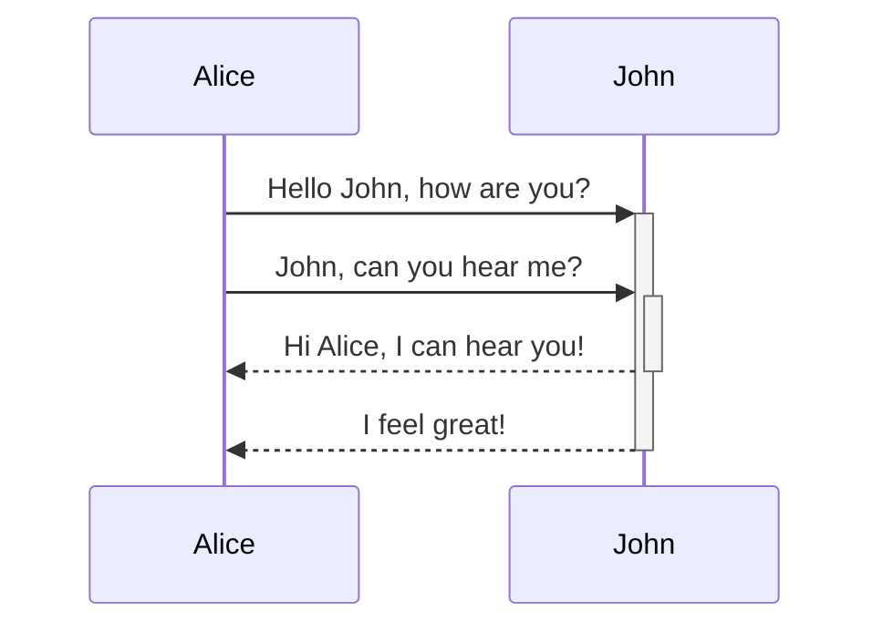
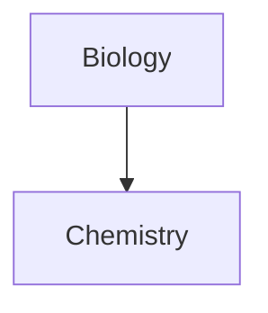

---
aliases:
  - Haladó Markdown
permalink: advanced-syntax
---
Ismerd meg, hogyan adhatsz hozzá haladó formázási szintaxist a jegyzeteidhez.

## Táblázatok

Táblázatokat hozhatsz létre függőleges vonalakkal (`|`) a oszlopok elválasztásához és kötőjelekkel (`-`) a fejlécek meghatározásához. Íme egy példa:

```md
| First name | Last name |
| ---------- | --------- |
| Max        | Planck    |
| Marie      | Curie     |
```

| First name | Last name |
| ---------- | --------- |
| Max        | Planck    |
| Marie      | Curie     |

A függőleges vonalak a táblázat két oldalán opcionálisak, de ajánlottak az olvashatóság érdekében.

> [!tip] **Élő előnézetben** jobb kattintással hozzáadhatsz vagy törölhetsz oszlopokat és sorokat a táblázathoz. A kontextus menü segítségével rendezheted és mozgathatod őket.

Táblázat beszúrásához használd a **Táblázat beszúrása** parancsot a [[Command palette|Parancspalettában]], vagy kattints jobb gombbal, és válaszd a _Beszúrás → Táblázat_ opciót. Ezzel egy alap, szerkeszthető táblázatot kapsz:

```md
|     |     |
| --- | --- |
|     |     |
```

Ne feledd, hogy a cellák nem kell tökéletesen igazodjanak, de a fejlécsorban legalább két kötőjelnek szerepelnie kell:

```md
First name | Last name
-- | --
Max | Planck
Marie | Curie
```

### Tartalom formázása táblázaton belül

Használhatod a [[basic formatting syntax|alap formázási szintaxist]] a táblázatok tartalmának stílusozására.

| Első oszlop       | Második oszlop                             |
| ------------------ | ----------------------------------------- |
| [[Internal links|Belső hivatkozások]] | Hivatkozás egy fájlra a **tárolón** belül. |
| [[Embed files|Fájlok beágyazása]]    | ![[Engelbart.jpg\|100]]                 |

> [!note] Függőleges vonalak táblázatokban  
> Ha [[aliases|álneveket]] szeretnél használni, vagy [[Basic formatting syntax#External images|képet átméretezni]] a táblázatban, egy `\` jelet kell hozzáadnod a függőleges vonal elé.
>
> ```md
> Első oszlop | Második oszlop
> -- | --
> [[Basic formatting syntax\|Markdown szintaxis]] | ![[Engelbart.jpg\|200]]
> ```
>
> Első oszlop | Második oszlop
> -- | --
> [[Basic formatting syntax\|Markdown szintaxis]] | ![[Engelbart.jpg\|200]]

A szöveget oszlopon belül igazíthatod, ha kettőspontokat (`:`) adsz hozzá a fejlécsorhoz. Tartalmat igazíthatsz **Élő előnézetben** is a kontextus menü segítségével.


```md
Balra igazított szöveg | Középre igazított szöveg | Jobbra igazított szöveg
:-- | :--: | --:
Tartalom | Tartalom | Tartalom
```

Balra igazított szöveg | Középre igazított szöveg | Jobbra igazított szöveg
:-- | :--: | --:
Tartalom | Tartalom | Tartalom

## Diagram

Jegyzeteidhez diagramokat és grafikákat adhatsz hozzá a [Mermaid](https://mermaid-js.github.io/) segítségével. A Mermaid számos diagramtípust támogat, például [folyamatábrákat](https://mermaid.js.org/syntax/flowchart.html), [sorrendi diagramokat](https://mermaid.js.org/syntax/sequenceDiagram.html) és [idővonalakat](https://mermaid.js.org/syntax/timeline.html).

> [!tip]  
> A diagramok létrehozása előtt próbáld ki a Mermaid [Live Editor](https://mermaid-js.github.io/mermaid-live-editor) felületét, hogy könnyebben összeállíthasd őket.

Mermaid diagram beszúrásához hozz létre egy `mermaid` [[Basic formatting syntax#Code blocks|kódrészletet]].


````md

````


````md

````


### Fájlok hivatkozása diagramokban

Létrehozhatsz [[internal links|belső hivatkozásokat]] a diagramjaidban, ha az `internal-link` [osztályt](https://mermaid.js.org/syntax/flowchart.html#classes) csatolod a csomópontokhoz.

````md

````


> [!note]  
> A diagramokban szereplő belső hivatkozások **nem jelennek meg** a [[Graph view|Grafikon nézetben]].

Ha sok csomópont van a diagramjaidban, használhatod az alábbi kódrészletet:

````md

````

Így minden betű csomópont belső hivatkozássá válik, a [csomópont szövegével](https://mermaid.js.org/syntax/flowchart.html#a-node-with-text) mint hivatkozás szövegével.

> [!note]  
> Ha speciális karaktereket használsz a jegyzetnevekben, dupla idézőjelekbe kell tenni a jegyzet nevét.
>
> ```
> class "⨳ speciális karakter" internal-link
> ```
>
> Vagy, `A["⨳ speciális karakter"]`.

További információ a diagramok létrehozásáról az [official Mermaid docs](https://mermaid.js.org/intro/) oldalon található.

## Matematika

Jegyzeteidhez matematikai kifejezéseket adhatsz hozzá a [MathJax](http://docs.mathjax.org/en/latest/basic/mathjax.html) és a LaTeX jelölés segítségével.

Matematikai kifejezés hozzáadásához foglald azt dupla dollárjelek (`$$`) közé.

```md
$$
\begin{vmatrix}a & b\\
c & d
\end{vmatrix}=ad-bc
$$
```

$$
\begin{vmatrix}a & b\\
c & d
\end{vmatrix}=ad-bc
$$

Matematikai kifejezéseket akár inline módon is beszúrhatsz, ha `$` jelek közé zárod.

```md
This is an inline math expression $e^{2i\pi} = 1$.
```

Ez egy inline matematikai kifejezés: $e^{2i\pi} = 1$.

További információért a szintaxisról látogasd meg a [MathJax alapvető útmutatót és gyorsreferenciát](https://math.meta.stackexchange.com/questions/5020/mathjax-basic-tutorial-and-quick-reference).

A támogatott MathJax csomagok listájáért lásd [A TeX/LaTeX bővítménylista](http://docs.mathjax.org/en/latest/input/tex/extensions/index.html).
